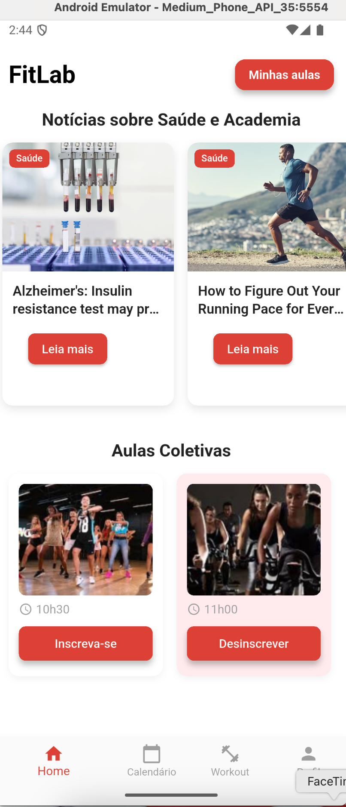
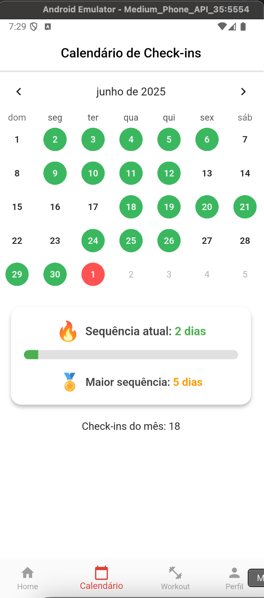
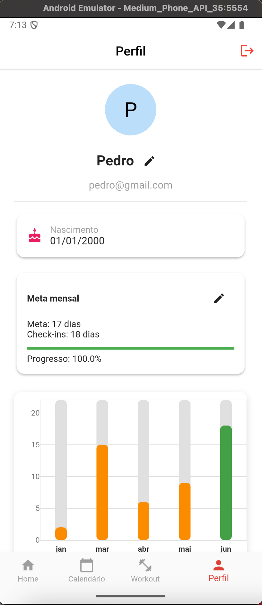

# 🏋️‍♀️ FitLab

**FitLab** é um aplicativo mobile desenvolvido em Flutter com foco em bem-estar, saúde e prática de atividades físicas. O app oferece um espaço para o usuário se manter atualizado com notícias da área, controlar sua frequência, se inscrever em aulas coletivas e realizar treinos com suporte de cronômetro.

---

## 📱 Funcionalidades

### 🔐 Autenticação

- Cadastro de usuário com nome, data de nascimento, e-mail e senha
- Validação de campos (formato da data, confirmação de senha)
- Login com autenticação via **Firebase Auth**
- Armazenamento de dados do usuário no **Cloud Firestore**

### 🏠 Home (Tela Principal)

- Feed de **notícias atualizadas** de fontes confiáveis da área de saúde, nutrição, fitness e bem-estar (via API)
- Detecção automática da **categoria da notícia**
- Inscrição em **aulas coletivas** (como Spinning e FitDance)
- Exibição das aulas nas quais o usuário está inscrito

### 📅 Calendário de Check-ins

- Registro diário de presença (check-in)
- Exibição em formato de calendário
- Armazenamento no **Firestore**
- Geração de estatísticas a partir da frequência

### 🏋️ Treinos e Exercícios

- Cadastro de fichas de treino personalizadas pelo usuário
- Busca de exercícios via API externa (ExerciseDB)
- Edição de exercícios: nome, peso, séries e imagens animadas
- Visualização de lista de exercícios por ficha
- Adição e exclusão de fichas e exercícios

### ⏱️ Cronômetro de Treino

- Timer simples e funcional para controle de tempo durante o treino
- Opções de tempo configuráveis (30s, 45s, 60s, 90s, etc)
- Botões para iniciar, pausar e reiniciar o cronômetro

### 🙋‍♂️ Perfil do Usuário

- Visualização de dados pessoais (nome, e-mail, data de nascimento)
- Edição de nome e meta mensal de check-ins
- Visualização de progresso mensal com gráfico de barras
- Botão para logout com confirmação

---

## 🧰 Tecnologias Utilizadas

- **Flutter** (Dart)
- **Firebase**
  - Authentication
  - Firestore
  - Firebase Core
- **HTTP**: Consumo de API externa para exercícios e notícias
- **Intl**: Formatação de datas em pt-BR
- **fl_chart**: Gráficos de progresso e check-ins

---

## 📱 Telas do App

### Tela Inicial

### Calendário de Check-ins

### Ficha de Treino

### Perfil do Usuário

